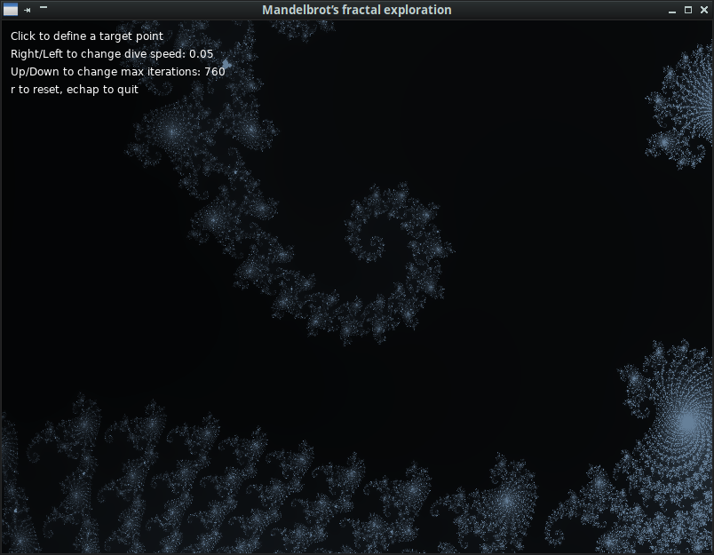

# Mandelbrot’s fractal exploration

A simple tool to visualize the famous fractal.
More on the subject [here](https://en.wikipedia.org/wiki/Mandelbrot_set).

[You can try it on line](https://jehadel.github.io/MandelbrotFractalExplo/) (not recommanded - ressource-consuming !)
 

Launch the demo :

        make play

Build a version  (with love.js) : 

        make js

TODO : 

Improve interactivity
Add colors !
